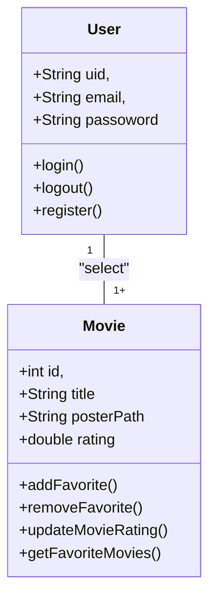
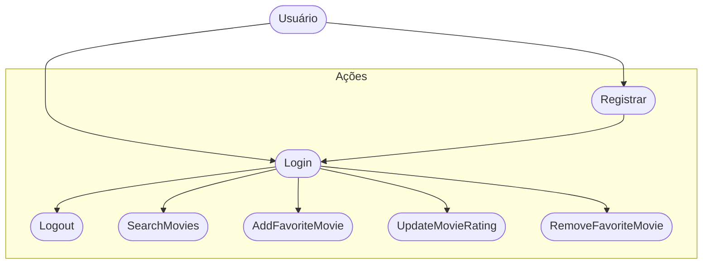

# cine_favorite (Formativa)

## Briefing
Construir um Aplicativo do Zero - O CineFavorite que permitirá criar uma conte e buscar filmes em uma API,
montar uma galeria pessoal de filmes favoritos, com poster(capa) e nota avaliativa do usuario para o filme.

## Objetivos
- criar uma Galeria Personalizada por Usuário de Filmes Favoritos
- buscar Filmes em uma API e listar para selecionar filmes favoritos
- Criação de Contas por usuário
- listar filmes por Palavra-Chave

## Levantamento de Requisitos
- ### Funcionais
- ### Não Funcionais

## Recurso do Projeto
- Linguagem de Programação: Flutter/Dart
- API TMDB: Base de dados pra filmes
- Figma: prototipagem
- GitHub: Para Armazenamento e versionamento do Código
- FireBase: Authentication / FireStore DB
- VsCode: codificação / Teste

## Diagramas
1. ### Classe:
Demonstrar o funcionamento das Entidades do Sistema
- Usuário (User:) classe já odelada pelo FireBaseAuth
    - Atributs:email,senha,uid
    - Métodos: login, registrar, logout

- Filmes favoritos (Movie): Classe Modelada pelo DEV - baseada na API TMDB
    - Atributos: id, título,PosterPath, Nota
    - Métodos: Adicionar, Remover,Listar, atualizarNota
    (CRUD)



2. ### Uso
Ação que os atores podem fazer
- Usuário:
    - Regitrar
    - Login
    - Logout
    - Procurar Filmes
    - Salvar Filmes aos Favoritos
    - Dar Nota aos Filmes Favorito
    - Remover Filmes dos Favoritos



3. ### Fluxo

Determinar o Caminho Percorrido pelo Ator paara excutar uma ação 

- Fluxo da Ação de Login

```mermaid

    A[Início] --> B{tela de login}
    B --> C[Inserir Email e Senha]
    C --> D{Validar as Credenciais}
    D --> Sim --> G[Favorite View]
    D --> Não -- B
```

## Prototipagem

link dos Protótipos

## 